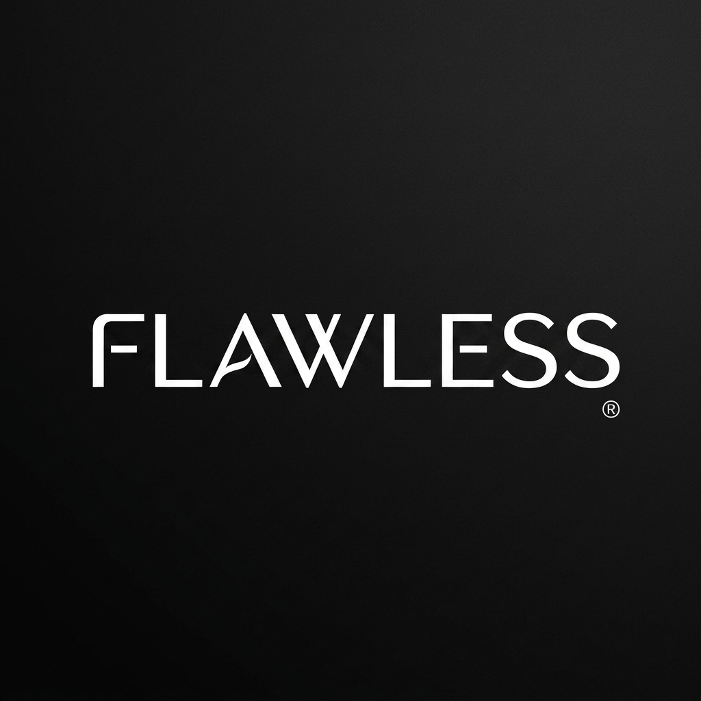
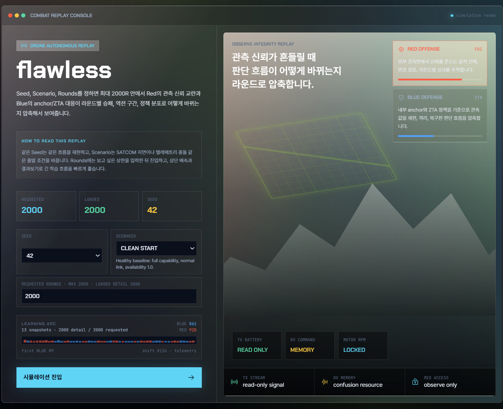
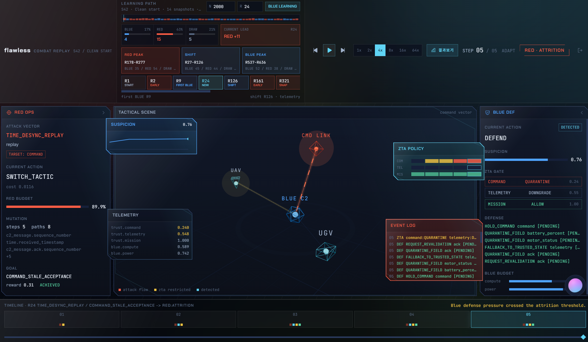
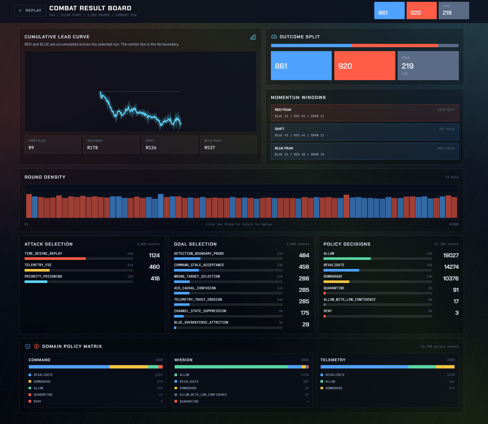

<p align="center">
  
</p>

# DAH Flawless — Red/Blue 사이버 AI 시뮬레이션

UAV·UGV·위성통신(SATCOM) 환경을 안전하게 추상화한 시뮬레이션 안에서 **Red AI가 Blue의 관측 입력을 오염**시키고 **Blue AI가 그 모순을 탐지·격리·복구**하는 적대적 공방을 재현한다. 실제 침투 도구가 아니라, "관측을 믿을 수 있는가(observe-integrity)"라는 문제를 AI 대 AI로 증명하는 연구용 시뮬레이터다.

- **Red**: `external_observe`(외부 신호/통신/메타데이터)의 값·시간·순서를 안전한 범위로 변조해 Blue의 임무 판단을 흔든다. 암호를 깨거나 시스템을 장악하지 않는다.
- **Blue**: `internal_observe`(Red가 못 건드리는 내부 앵커)와 관측 이력만으로 오염을 추정하고, ZTA(Zero Trust) 정책으로 오염 도메인을 제한·복구한다. 정답지(scorer truth)는 절대 못 본다.

---

## 실행 방법 (심사·데모용)

전제:

- **Docker Desktop 실행 중**
- 저장소 루트(`DAH_Flawless`)에서 실행
- 로컬 포트 **8080** 사용 가능
- 심사·데모용 프론트는 저장소에 포함된 `frontend/dist/index.html` 단일 번들을 서빙한다. Node/npm 설치나 `.env` 파일은 필요 없다.

```bash
docker compose up frontend
```

이미 빌드된 Docker 이미지가 오래된 경우에만 아래처럼 다시 빌드한다.

```bash
docker compose up --build frontend
```

브라우저에서 **http://localhost:8080** 을 연다.

브라우저로 연 뒤에는 `F11`을 눌러 전체 화면으로 보는 것을 권장한다.

랜딩(시작) 화면 → **"시뮬레이션 진입"** → 3D 전술 대시보드가 뜬다.

| 영역 | 내용 |
|---|---|
| 좌측 RED OPS | 공격 벡터·현재 행동·mutation·목표/보상 |
| 중앙 3D 전장 | UAV·UGV·CMD LINK·BLUE C2 노드, 공격 흐름 라인, 탐지 펄스 |
| 우측 BLUE DEF | 의심도·ZTA 게이트 판정·방어 행동·예산 |
| 위성 창 | Suspicion 추이·ZTA 정책 히트맵·텔레메트리·이벤트 로그 |
| 하단 | 스텝 타임라인 + 스크러버 |

조작: `Space` 재생/정지, `←/→` 스텝 이동, 상단 라운드 입력/타임라인으로 라운드 이동, 배속 버튼으로 긴 흐름 스캔, `결과보기`로 승패·공격 선택·정책 분포 요약 확인.

종료:

```bash
docker compose down
```

> 대시보드는 실제 백엔드 시뮬레이션 결과를 **재현 가능한 리플레이**로 시각화한다. `seed=42`, `clean_start`는 로컬에서 2000R까지 생성해 긴 학습 흐름을 볼 수 있고, 다른 seed/scenario는 가벼운 샘플 리플레이로 동작한다.

---

## 화면 예시

프론트엔드 replay console의 초기 화면입니다. Seed, Scenario, Requested Rounds, Loaded Rounds를 확인하고 시뮬레이션 replay로 진입할 수 있습니다

<p align="center">
  
</p>

특정 라운드의 step 단위 진행 화면입니다. 현재 step, 선택된 attack vector, goal, suspicion score, ZTA policy decision, event log, timeline을 한 화면에서 확인합니다.

<p align="center">
  
</p>

2000라운드 실행 결과를 집계한 화면입니다. 승패 분포, 누적 lead curve, 라운드 밀도, 공격 선택 분포, 목표 선택 분포, 정책 decision 분포를 검토할 수 있습니다.

<p align="center">
  
</p>

---

## 의존성

심사·데모 실행(`docker compose up frontend`)에는 Docker Desktop과 Docker Compose v2만 필요하다. 컨테이너는 `python:3.11-slim` 기반으로 빌드되고, 런타임에는 Node를 설치하지 않는다. 프론트엔드는 이미 빌드된 `frontend/dist/index.html`을 Python 정적 서버로 서빙한다.

로컬에서 백엔드/Streamlit을 직접 실행하려면:

- Python 3.11 이상
- `pip install -r requirements.txt`
- `PYTHONPATH=src`
- Python 패키지: `streamlit`, `Pillow`, `reportlab`

프론트엔드 소스를 수정하거나 새로 빌드하려면:

- Node.js 20.19 이상 또는 22.12 이상
- `frontend/package-lock.json` 기준 `cd frontend && npm install`
- 주요 프론트 의존성: React 19, Vite, TypeScript, Tailwind CSS, Three.js, React Three Fiber, Drei, Zustand, Motion
- `data/frontend/runs/seed42_clean_start_2000.json`이 없으면 먼저 2000R 데이터를 생성한 뒤 빌드한다.

---

## 환경변수

심사·데모용 프론트 실행에는 별도 환경변수가 필요 없다.

외부 LLM은 선택 기능이다. 설정하지 않아도 시뮬레이션과 프론트 데모는 오프라인 fallback으로 동작한다.

| 변수 | 필요 시점 | 기본값/설명 |
|---|---|---|
| `PYTHONPATH=src` | 로컬 Python 실행 | Docker 이미지에는 `/app/src`로 이미 설정됨 |
| `DAH_POLICY_REVIEW_ENABLED` | 선택: 정책 업데이트 외부 LLM 리뷰어 사용 | 기본 `false`, 비활성 시 로컬 heuristic fallback |
| `DAH_POLICY_REVIEW_PROVIDER` | 선택: 정책 업데이트 외부 LLM 리뷰어 사용 | 기본 `openai_compatible` |
| `DAH_LLM_BASE_URL` | 선택: 정책 업데이트 외부 LLM 엔드포인트 | 기본 `http://127.0.0.1:8000/v1` |
| `DAH_LLM_MODEL` | 선택: 정책 업데이트 외부 LLM 모델 | 기본 `local-reviewer` 또는 설정 파일 값 |
| `DAH_LLM_API_KEY` | 선택: 정책 업데이트 외부 LLM API 키 | 기본 `EMPTY` |
| `DAH_LLM_TIMEOUT_S` | 선택: 정책 업데이트 외부 LLM 타임아웃 | 기본 `2` |
| `DAH_MUTATION_REVIEW_ENABLED` | 선택: mutation approval 외부 LLM 리뷰어 사용 | 기본 `false`, 비활성 시 로컬 heuristic fallback |
| `DAH_MUTATION_REVIEW_PROVIDER` | 선택: mutation approval 외부 LLM 리뷰어 사용 | 기본 `openai_compatible` |
| `DAH_MUTATION_REVIEW_BASE_URL` | 선택: mutation approval 외부 LLM 엔드포인트 | 기본 `http://127.0.0.1:8000/v1` |
| `DAH_MUTATION_REVIEW_MODEL` | 선택: mutation approval 외부 LLM 모델 | 기본 `local-mutation-approval-reviewer` |
| `DAH_MUTATION_REVIEW_API_KEY` | 선택: mutation approval 외부 LLM API 키 | 기본 `EMPTY` |
| `DAH_MUTATION_REVIEW_TIMEOUT_S` | 선택: mutation approval 외부 LLM 타임아웃 | 기본 `2` |

---

## 로컬(파이썬)에서 직접 돌리기

전제: Python 3.11+ (개발은 3.12에서 확인).

```powershell
# 저장소 루트에서
$env:PYTHONPATH='src'

# 기본 5라운드 시뮬레이션
python -m dah_flawless.main --seed 42 --rounds 5 --reset-logs `
  --out data/logs/round_logs.jsonl --summary data/logs/summary.json

# 동적 combat 리플레이 + 프론트엔드 JSON 재생성 (대시보드 데이터)
python -c "from pathlib import Path; from dah_flawless.environment.round_combat_runner import run_combat_rounds; run_combat_rounds(seed=42, rounds=6, max_steps=30, log_path=Path('data/logs/round_logs.jsonl'), summary_path=Path('data/logs/summary.json'), frontend_log_path=Path('data/frontend/combat_replay.json'))"

# Streamlit 대시보드 (로컬)
streamlit run streamlit_app.py
```

기타 실행 옵션:

```powershell
# 30-step 에피소드
python -m dah_flawless.main --seed 42 --episodes 2 --steps-per-episode 30

# 학습 cadence (Blue-only -> Red-only -> fixed-eval) + holdout 일반화 평가
python -m dah_flawless.main --seed 42 --training-schedule --steps-per-episode 30 --holdout-eval

# 특정 시나리오 (clean_start / degraded_start / satcom_delay / gnss_degraded /
#                c2_metadata_noisy / telemetry_conflict / low_trust_start)
python -m dah_flawless.main --seed 42 --rounds 5 --scenario satcom_delay
```

프론트엔드를 수정할 경우:

```powershell
cd frontend
npm install
npm run dev        # 개발 서버
npm run build      # dist/index.html 단일 번들 재생성 (Docker가 이걸 서빙)
```

---

## 2000R 데이터 생성 방법

2000R 원본 로그는 약 700MB, 프론트용 JSON도 약 80MB라 Git에 올리지 않는다. 저장소에는 생성 스크립트만 두고, 데모 머신에서 필요할 때 같은 seed/scenario로 다시 뽑는다.

```powershell
$env:PYTHONPATH='src'
python scripts/generate_2000_replay.py --rounds 2000 --seed 42 --scenario clean_start
```

생성 위치:

- `data/logs/round_2000_logs.jsonl`
- `data/logs/round_2000_summary.json`
- `data/frontend/runs/seed42_clean_start_2000.json`

새로 뽑은 뒤 프론트 번들과 Docker 서빙 파일을 갱신하려면:

```powershell
cd frontend
npm run build
cd ..
docker compose up -d --build frontend
```

## 프로젝트 구조

```text
src/dah_flawless/
  world/          raw_world generator·feature extractor·state adapter
  attacks/        goal planner·attack selector·mutation engine·mutation policy
  blue/           threat detection·goal consistency·defense·ZTA gate·feedback learner
  scoring/        scorer·goal scorer·mission impact·causal consistency
  environment/    round combat runner·episode runner·training scheduler·holdout evaluator
  reporting/      report generator·frontend_log projection
  llm/            역할별 외부 LLM 어댑터 + 순수코드 fallback
frontend/         React 19 + Vite + R3F 3D 대시보드 (dist/index.html 단일 번들)
streamlit_app.py  라이브 재실행 콘솔 (백업)
```

주요 로그 필드 대표:

| 필드 | 의미 |
|---|---|
| `blue_input_redacted` | Blue 입력에서 scorer truth가 제거됐는지(불변식 검증) |
| `red_policy_state` / `blue_policy_state` | Red/Blue 정책 가중치·민감도·신뢰·피드백 카운트 |
| `red_goal` / `score.goal_success` / `score.goal_reward` | Red가 고른 cyber-effect 목표와 달성·보상 |
| `combat_steps` | 스텝별 Red/Blue action·suspicion·budget·중간 score |
| `score.containment_score` | Blue가 완전 복구 전 단계에서 effect를 억제한 정도 |
| `score.winner_side` / `winner_detail` | 승패 주체와 세부 결과(BREACH·RECOVERY·CONTAINMENT 등) |
| `score.evidence.mission_impact` | 오염이 임무 판단/안전/명령 freshness/가용성에 준 영향 |
| `zta_policy.per_domain` | 도메인별 ZTA 판정과 정답 여부 |

---

## 구현 범위 (정직한 경계)

**구현됨:** 규칙기반 raw_world 생성, observe mutation 엔진·정책(clamp/reject), Red goal planner·attack selector, Blue 탐지·ZTA 게이트·단계 방어·feedback 학습, goal-aware/mission-impact scorer, 라운드별 정책 coevolution, 학습 스케줄·holdout 일반화 평가, 로그 해시 체인, 3D 리플레이 대시보드.

**아직 아님(다음 단계 설계):** VAE 기반 world generator, 실제 RF/API adapter, 실제 네트워크 공격 실행, 신경망 기반 정책. 외부 LLM 리뷰어는 선택 사항이며 실패 시 오프라인 heuristic으로 fallback한다.

**표현 원칙:** Red는 관측값·시간·순서·메타데이터를 안전하게 변조할 뿐 시스템을 장악하지 않는다. `scorer_truth`는 채점용 정답지이지 Blue 화면이 아니다. 실제 RF/exploit과 학습형 고도화는 "현재 구현"이 아니라 "확장 설계"로 구분해 설명한다.
