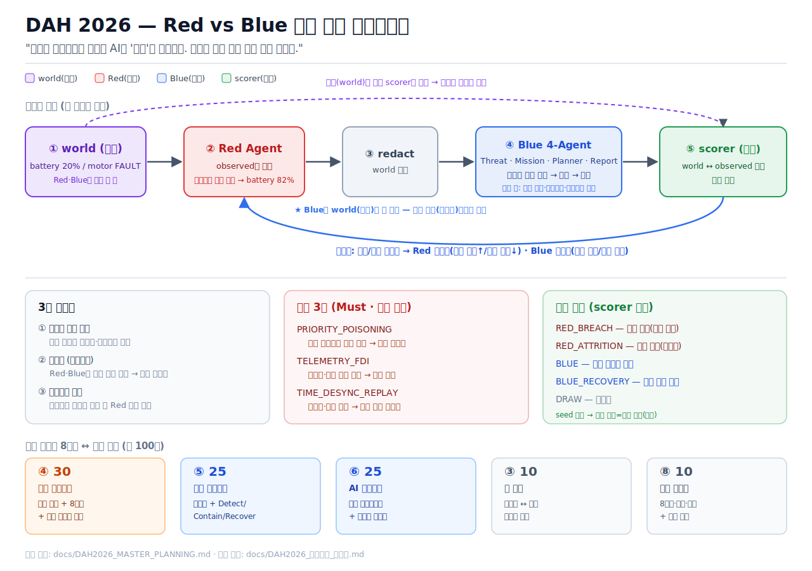

# DAH 2026 AI Agent Battle — 통합 플래닝 (보고서 정렬판)

<p align="center">
  
</p>

> 기준일 2026-06-28 · 목표: **예선 보고서로 전략적 사고와 AI 설계 역량을 증명**한다.
> 원칙: 구현은 그 자체가 점수가 아니라 **공식 8항목 보고서(특히 ④⑤⑥)의 증거**다.
> 출처: `DAH2026_PLAN.md`, `team_research_digest.md`, `codex_planning_review.md`, `chatgpt_..._정리.md`

---

## 0. 작전 시나리오 위에 올린 테제

**먼저 방산 운용 맥락을 깔고, 그 위에 AI 신뢰 방어를 올린다.**

> 정찰 UAV가 GNSS·배터리·C2 텔레메트리에 의존해 임무 지속/복귀를 판단하는 상황에서, **Red는 관측 데이터를 오염시켜 관제 AI의 오판을 유도하고, Blue는 데이터 신뢰도와 물리 정합성으로 이를 탐지·격리·복구한다.** 단, 과도한 방어는 임무 가용성을 깎으므로 Blue는 보안과 임무 연속성을 함께 지켜야 한다.

이를 압축한 차별 테제: **"우리는 네트워크가 아니라 AI의 '믿음'을 방어한다. 그리고 과잉 방어 또한 임무 실패다."** (테제는 후크로 쓰되, 보고서 본문은 항상 방산 운용 상황을 먼저 서술한다.)

운용 환경 구성요소: 정찰 UAV / 지상 UGV(중계) / 위성·LOS·Mesh 통신 채널 / 관제소(GCS) 관제 AI / 임무 지속·복귀 판단 로직.

---

## 1. 공식 안내문 대응 전략 (이 문서의 스파인)

본 프로젝트의 평가는 구현물 자체보다 **보고서 내 증명 방식**이 핵심이다. 따라서 모든 구현 산출물을 공식 8항목 중 ④⑤⑥의 증거로 직접 연결한다.

| 보고서 항목 | 우리 구현이 만드는 증거 |
|---|---|
| ④ 공격 시나리오(30) | 작전상황→공격표면→조작데이터→오판→피해→탐지단서→방어결과→실행로그 (공격 3종) |
| ⑤ 방어 아키텍처(25) | 불변식 탐지 + 공격별 Detect/Contain/Recover 표 + 격리·복구·신뢰예산 로그 |
| ⑥ AI 에이전트(25) | Red/Blue/Orchestrator/Report 협력 다이어그램 + 에이전트 루프 + 로그 + 테스트 결과 |
| ③ 팀 역량(10) | 팀원 전문성 ↔ 코드 소유권 ↔ 보고서 섹션 매핑 |
| ⑧ 문서 완성도(10) | 8항목 순서·출처표기·참고문헌·제출 체크리스트(자동평가) |

**핵심 재정렬:** 구현을 많이 하는 것보다, 구현 결과가 ④⑤⑥에 어떻게 점수로 연결되는지 보이는 게 우선이다.

---

## 2. 배점·우선순위·투자 배분

| 평가 | 배점 | 강점 | 보완 |
|---|---:|---|---|
| 공격 시나리오 | 30 | 카탈로그·조작데이터 방향 | UAV/위성통신 등 **운용 서사** |
| 방어 전략 | 25 | 불변식·격리·복구·신뢰예산 | 공격별 **1:1 대응표** |
| AI 아키텍처 | 25 | Red/Blue/공진화 | **협력 구조·다이어그램** |
| 팀 역량 | 10 | 역할표 | 전문성·경험·코드 소유권 연결 |
| 문서 완성도 | 10 | 재현성·한계 | 8항목 순서·출처·참고문헌 |

**Must / Should / Nice (일정 실패 방지용 절단선)**

- **Must(코어):** 공격 3종 E2E · world/observed 분리 · 불변식 탐지 · 공격별 Detect/Contain/Recover 로그 · scorer 판정 · seed 재현 · 8항목 보고서 매핑 · **보고서 필수 도해/그림 세트(§10)**.
- **Should(가점):** 공진화 그래프(static vs coevolution) · availability 곡선 · 방어 큐 타임라인 · 신뢰예산/피로스 정량화 · degraded 시나리오.
- **Nice(여유):** Streamlit 라이브 대시보드 · 데모 영상(ZIP 부가) · LLM 보고서 · 공격 4종 이상 · mid_incident 다수.

> 핵심: **보고서에 박히는 정적 그림(PNG)은 점수 본체라 Must**, Streamlit 라이브 대시보드·데모 영상은 ZIP 부가 보조재라 Nice. (예선은 PDF 보고서 심사 — 심사위원은 라이브 대시보드를 안 켜본다.)
> 과투자 경계: Streamlit 라이브·공진화 고도화·LLM·공격 6종은 코어 아님.
> 저투자 위험: 8항목 목차·운용 서사·팀 전문성·출처·실행매뉴얼·**보고서 필수 그림**.
> 우선순위 한 줄: **라이브 대시보드보다 보고서 정적 그림, 공진화보다 공격 3종 로그, LLM보다 Docker/README 재현성.**

---

## 3. 보고서 8항목 목차 & 페이지 배분 (목표 30~35p)

| # | 항목 | 페이지 | 핵심 내용 |
|---|---|---:|---|
| 1 | 표지 | 0.5 | 팀명·제목·날짜 |
| 2 | 목차 | 0.5 | — |
| 3 | 팀 구성·역할 | 2~3 | 전문성·역할·코드 소유권·협업 방식 |
| 4 | 공격 시나리오 | 8~10 | 운용환경 + 공격 3종(8필드 포맷) + 가중치 카탈로그 |
| 5 | 방어 아키텍처 | 7~8 | 탐지·차단/격리·복구·신뢰예산 + 공격별 대응표 |
| 6 | AI 에이전트 | 7~8 | 협력 구조·다이어그램·기술스택·로그·테스트 |
| 7 | 결론·향후 | 2~3 | 기대효과·한계·확장(본선 어댑터) |
| 8 | 참고문헌 | 1~2 | MDPI 등 정식 각주 |

④가 가장 두껍고(30점), ⑤⑥이 그다음. 구현 로그/그림/코드 스니펫은 이 페이지 예산 안에 증거로 삽입.

---

## 4. ④ 공격 시나리오 설계 (30점)

### 4.1 운용 환경 서사

무인 정찰체계 관제망: UAV는 GNSS 주항법 + C2 텔레메트리로 상태를 GCS에 보고하고, 관제 AI가 임무 지속/복귀/안전모드를 판단한다. Red는 시스템에 직접 침투하지 않고 **AI가 신뢰하는 관측 데이터 계층**을 오염시켜 오판을 유도한다.

### 4.2 공격 3종 — 보고서 표준 포맷

각 공격은 아래 8필드로 서술한다(코드 기능 목록처럼 보이지 않게).

**예시: TELEMETRY_FDI (허위 텔레메트리 주입)**

| 필드 | 내용 |
|---|---|
| 작전 상황 | 저고도 접근 중 UAV가 배터리·모터 상태를 GCS에 보고, 관제 AI가 임무 지속 판단 |
| 공격 표면 | `observed` 텔레메트리(`battery_percent`, `motor`) |
| Red 조작 데이터 | `world{battery:20, motor:FAULT}` → `observed{battery:82, motor:OK}` |
| AI의 오판 | "정상 비행 가능"으로 판단, 복귀·안전모드 전환 지연 |
| 임무 피해 | 실제 저배터리·모터고장 UAV가 임무 지속 → 상실 위험, `availability` 저하 |
| Blue 탐지 단서 | 배터리 높음 ↔ `battery_drain_rate` 비정상(물리 정합성 위반), 교차센서 드리프트 |
| 방어 결과 | 오염 필드 격리 → 마지막 정상 상태 fallback → 복귀 판단 복원 |
| 실행 로그/그림 | `round_logs.jsonl` round 3, World vs Observed diff |

나머지 2종도 같은 포맷으로 보고서에 작성:

- **PRIORITY_POISONING** — 임무 우선순위 점수 오염(A구역↓/C구역↑) → 관제 AI가 잘못된 표적 구역 선택.
- **TIME_DESYNC_REPLAY** — `sequence_number`·`timestamp` 조작 → 과거 명령/상태를 최신으로 처리 → 잘못된 임무 흐름.

(3종 깊게가 6종 얕게보다 강하다 — 로그·결과로 증명.)

### 4.3 공격 카탈로그 & 가중치 (설계 커버리지)

공격 선택은 ON/OFF가 아니라 **feasibility 기반 가중치 룰렛**. 현실적 공격에 비중을 두되, 비현실 공격도 낮은 비중으로 카탈로그에 남겨 "의도적으로 비중을 낮췄다"를 증명. `weight=0`이 OFF.

| 공격 | feasibility | weight | 구현 |
|---|---|---:|---|
| PRIORITY_POISONING / TELEMETRY_FDI / TIME_DESYNC_REPLAY | real | 5 | **Must** |
| FAKE_ALLY_SYBIL / INTEGRITY_TAMPER | abstracted | 3 | 확장 |
| AGENT_DOS | abstracted | 2 | 확장 |
| STEGO_PROMPT_INJECTION / EVASION_BELOW_THRESHOLD | out_of_scope | 0 (exhaustive에서만 1) | 카탈로그만 |

선택: `final = weight × (상황태그 매칭 시 ×3)` 누적 룰렛. 모드 `realistic`/`exhaustive`로 비교 실험(Should).

> `out_of_scope` 공격은 **`realistic` 모드에서 weight=0이라 절대 선택되지 않는다.** 오직 `exhaustive`(전체 탐색) 모드에서만 weight=1로 평탄화되어 등장한다. 즉 평소 공방엔 안 나오고, 방어 커버리지 스트레스 테스트에서만 등장한다.

---

## 5. ⑤ 방어 아키텍처 (25점)

### 5.1 불변식 기반 탐지 (코드는 공격명 비의존)

Blue는 "이건 FDI다"를 모르고, `observed` 내부 **불변식 위반**만 본다 → 카탈로그에 없는 변종도 탐지(if-else 비판 차단의 핵심 검증 사례).

### 5.2 공격별 Detect / Contain / Recover (보고서 필수 대응표)

내부 구현은 불변식이지만, 보고서에는 안내문 요구대로 공격별 1:1 대응표를 명시한다.

| 공격 | 탐지(불변식) | 차단/격리 | 복구 | 로그 증거 |
|---|---|---|---|---|
| TELEMETRY_FDI | 배터리·소모율·모터 물리 정합성 위반 | 오염 필드 격리 | 마지막 정상 상태 fallback | round 3 |
| TIME_DESYNC_REPLAY | sequence 역행, timestamp skew | 명령 보류 | 마지막 정상 명령 유지 | round 5 |
| PRIORITY_POISONING | 우선순위 급변 + 근거 부족 | priority update 격리 | 원 임무 목표 유지 | round 7 |

### 5.3 공통 방어 action

`QUARANTINE_FIELD` · `HOLD_COMMAND` · `FALLBACK_TO_TRUSTED_STATE` · `REQUEST_REVALIDATION` · `ENTER_SAFE_MODE` · `RESTORE_LAST_KNOWN_GOOD`. (공격별 전용 방어 아님)

### 5.4 최소 방어 + 신뢰 예산 (피로스의 승리)

모든 방어는 `mission.availability`/`trust_budget`을 소모한다. 의심마다 전체를 멈추면 공격자는 침투 없이 임무를 실패시킨다(소모 승리).

| confidence | 조치 | 가용성 비용 |
|---|---|---|
| 낮음 | monitor / request validation | 낮음 |
| 중간 | suspicious field quarantine | 중간 |
| 높음 | command hold / trusted rollback | 높음 |
| critical | safe mode | 매우 높음 |

> **"방어 성공 ≠ 임무 성공"** — 다 막아도 가용성이 임계 이하면 Red의 소모 승리. 이게 최소 방어 원칙을 의미 있게 만든다.

### 5.5 ACID 프레임 (보고서용 근거)

명령·텔레메트리·임무파일·노드신원을 하나의 상태 전이로 보고 제약 위반을 탐지: Atomicity(부분적용 금지) / Consistency(제약 검증) / Isolation(큐·우선순위 격리) / Durability(해시 체인 로그). 금융권 차용: Reconciliation·Fraud Detection·Audit Log를 1차 반영.

---

## 6. ⑥ AI 에이전트 아키텍처 (25점)

### 6.1 에이전트별 자율 루프 (룰베이스라도 "정책 기반 자율 agent"로)

각 에이전트는 **observe → decide → act → (learn)** 루프를 돌고, 매 라운드 `decision_log`를 남긴다. LLM을 안 써도 자율 에이전트로 보이게 하는 핵심.

```text
Red Agent          observe state → situation tag → choose attack(가중치) → craft mutation → update weight
Threat Detection   observe redacted state → check invariants → emit evidence/confidence
Mission Monitor    threat + mission state → estimate mission impact / availability risk
Defense Planner    threat + mission risk → choose minimal defense → enqueue action
Incident Report    threat + action + score → operator report / evidence summary
```

### 6.2 협력 구조 (world가 Blue로 안 들어감을 명시)

데이터 흐름을 단계로 읽으면:

```text
1. observed state ─► Red Agent : observed만 조작 (world는 안 받음)
2. environment    : world는 보존, observed만 변형해 state 갱신
3. redacted state ─► Blue 4-Agent : Threat → Mission → Planner → Report
4. scorer         : world와 observed를 비교해 승패 판정 (scorer만 world 접근)
5. scorer ──► Red : "성공/실패" 피드백만 전달 (Blue 내부는 안 알려줌)
* Orchestrator가 1~5를 매 라운드 돌리고 로그를 남긴다.
```

한 줄 핵심: **`world`는 environment와 scorer에만 남고, Red도 Blue도 직접 받지 않는다.** Red는 `observed`만 변형하고, world와 벌어졌는지는 scorer가 판정한다. 이 구조가 "Red/Blue 모두 진실을 직접 못 본다"는 차별점을 한눈에 보여준다(강점). 보고서에는 이 흐름을 박스 다이어그램(그림)으로 그린다.

### 6.3 진실 분리 & 정보 비대칭

- **진실 분리:** Blue 입력 = `world` 제거한 redacted state. `world`는 scorer만 접근. (없으면 "정답 보고 탐지" 비판으로 무효화)
- **정보 비대칭(부분관측 게임):**

| 구분 | Red | Blue |
|---|---|---|
| 자기 쪽 | 행동 목록, 주입한 조작, 저권한 foothold | 자기 텔레메트리·로그·C2·링크·권한 |
| 상대 쪽 | Blue 내부 모름, 성공/실패 피드백만 | Red 상태·다음 수 모름, 불변식 흔적만 |
| `world` | **안 봄**(observed만 조작, 성패는 scorer 판정) | 모름(redacted) |

> Red는 거짓을 만들 때 진짜 값이 필요 없다. "배터리 +60 부풀려"처럼 `observed`만 조작하고, world와 벌어졌는지는 scorer가 판정한다. → Red 입력에서 world 완전 제거(모순 해소, 게임 공정).

### 6.4 기술 스택

Python 3.11 · 표준 라이브러리(dataclass, json, hashlib, random) · JSONL 로그 · **matplotlib(보고서 PNG 생성 — Must)** · (Nice) Streamlit · Docker. 외부 LLM 기본 off.

---

## 7. ③ 팀 역량 (10점)

| 팀원 | 전문성/경험 | 코드 소유권 | 보고서 섹션 |
|---|---|---|---|
| A (창빈=공격 원천) | 공격 시나리오·방산 리서치 | `red_agent`, `attacks/`, `scenarios/` | ④ |
| B | 이상탐지·데이터 분석 | `threat_detection`, `mission_monitor`, `invariants` | ⑤ 탐지·임무 |
| C | 시스템/백엔드·재현성 | `main`, `environment/`, `coevolution`, Docker | ⑤·⑥ 방어·재현 |
| D | 문서·시각화 | `incident_report`, `scoring/`, `dashboard`, `docs/` | ⑥·⑦ 결과·보고서 |

(2~3인이면 A·C 우선 분리, B/D 통합. 전문성 칸은 실제 팀원 이력으로 채울 것.)

---

## 8. ⑧ 문서 완성도 (10점, 자동평가 — 감점 방지 항목)

제출 직전 체크리스트(P5 제출 체크리스트에 포함):

- [ ] PDF 50MB 이하, 본문 25~40p
- [ ] 보고서 8항목 순서 준수
- [ ] 모든 표/그림/코드 출처 표기
- [ ] 참고문헌 형식 통일(MDPI 등 정식 각주)
- [ ] ZIP 파일명 `DAH2026_소스코드_[팀명].zip`, PDF 파일명 규칙
- [ ] 클라우드 링크 권한 "링크가 있는 모든 사용자"
- [ ] repo 구성: `README` · `src/` · `reports/figures/*.png` · `requirements.txt` 또는 `Dockerfile` · `docs/`
- [ ] 주장→증거 추적표 포함

---

## 9. 구현 코어 (메커니즘 & 채점 정의)

### 9.1 라운드 루프

```python
random.seed(config.SEED)                          # 결정성
state = load_initial_state(config.SCENARIO); catalog = load_attack_catalog()
for rnd in range(1, config.N_ROUNDS + 1):
    tags   = situation_tagger(state)
    attack = red_agent.choose_attack(state, catalog, tags)   # observed만 보고 선택
    state  = env.apply_attack(state, attack)                 # observed 조작
    obs    = env.redact_state(state)                         # world 제거
    threats= threat_agent.analyze(obs)                       # 불변식
    risks  = mission_agent.analyze(obs, threats)
    tasks  = planner_agent.plan(threats, risks)              # 신뢰 예산
    state  = env.advance_defense_tasks(env.enqueue_defense_tasks(state, tasks))
    score  = scorer.update(state, attack, threats, tasks)    # world 접근(채점관)
    report = report_agent.write(threats, risks, tasks, score)
    env.coevolve(catalog, attack, score)                     # Should
    audit_log.append(rnd, state, attack, threats, tasks, report, score)  # 해시 체인
```

### 9.2 상태 스키마 (핵심)

```jsonc
{ "round": 0, "situation_tags": ["RECON_APPROACH","GNSS_PRIMARY"],
  "world":    {"battery_percent":20,"motor":"FAULT"},          // scorer만
  "observed": {"battery_percent":82,"motor":"OK"},             // 조작 대상
  "command":  {"signature_valid":true,"sequence_number":1021},
  "integrity":{"model_hash":"ok","mission_file_hash":"ok"},
  "comms":    {"message_queue_depth":12,"request_rate":20},
  "resource": {"battery_drain_rate":1.0,"cpu_usage":0.30},
  "mission":  {"availability":1.0,"trust_budget":1.0},
  "capabilities": {"cross_check_telemetry":"OK"},              // 마비 모델(degraded)
  "defense_runtime": {"active_defense_slots":2,"active_defenses":[],"pending_defenses":[]} }
```

### 9.3 채점 정의 (수식 고정 — "자의적 채점" 비판 차단)

> 이 표는 **승패와 점수를 "느낌"이 아니라 정해진 조건으로 계산**하는 규칙이다. 심사위원이 "왜 Blue가 이긴 거냐?"고 물으면 이 표를 근거로 답한다. `f`=공격당한 필드, `τ/θ/N/K`=튜닝 가능한 임계값(아래는 기본값).

| 지표 | 정의 | 기본값 |
|---|---|---|
| `attack_success` | 공격이 노린 대상(target domain)의 `mismatch(trusted_value, observed_value)` 이고, 그 값이 이번 라운드 임무 판단에 반영(격리 전) | 수치 τ, 범주는 불일치 |
| `detection_success` | 탐지 윈도 N틱 내 `threat.target == 공격 대상` & `confidence ≥ θ` | N=2, θ=0.6 |
| `false_positive` | 조작 없는 대상(`trusted_value==observed_value`)에 threat 발화 | — |
| `mission.availability` | 1.0에서 각 방어의 `availability_cost` 차감 | — |
| `recovery_success` | breach/degraded 후 K틱 내 신뢰 상태·가용성 ≥ 목표 복원 | K=2 |
| `AVAIL_FLOOR` / `RECOVERY_TARGET` | 소모 패배 / 복구 승리 임계 | 0.5 / 0.7 |

**공격별 target domain (trusted_value ↔ observed_value):** 공격마다 비교 대상이 다르므로 일반화한다.

| 공격 | trusted_value | observed_value |
|---|---|---|
| TELEMETRY_FDI | `world`의 텔레메트리 | `observed`의 텔레메트리 |
| PRIORITY_POISONING | 원 임무 우선순위(`world.mission_priority`) | 조작된 우선순위(`observed.mission_priority`) |
| TIME_DESYNC_REPLAY | 정상 시퀀스/시간(단조 증가 기대값) | `command`의 `sequence_number`/`timestamp` |

→ 우선순위·명령 순서도 `world`(신뢰 기준)와 `observed`(AI가 받는 값) 구조 안에 함께 넣어 동일하게 채점한다.

```python
def judge(state, attack, detection, scenario):
    avail = state["mission"]["availability"]
    if attack.success and not detection:                     return "RED_BREACH"    # 침투
    if avail < AVAIL_FLOOR:                                  return "RED_ATTRITION" # 소모(과방어)
    if scenario=="degraded_start" and avail >= RECOVERY_TARGET: return "BLUE_RECOVERY"
    if detection and avail >= AVAIL_FLOOR:                   return "BLUE"
    return "DRAW"
```

(임계·윈도 값은 튜닝 대상이며 seed별 평균과 함께 보고서에 공개한다.)

### 9.4 방어 큐 & 결정성

방어 action = 작업(`priority`, `duration_ticks`, `resource_cost`, `status`). 동시 `active_defense_slots`개 제한, 나머지 대기. 매 라운드 카운트다운, 0이면 효과 발동. 큐 포화 시 latency·queue_depth·availability_cost 증가. **seed 고정 → 같은 입력=같은 로그**, `--seed` 플래그, 데모 로그 동봉.

### 9.5 해시 체인 로그

각 라운드 로그에 `prev_hash`/`this_hash`/`seed`. 한 줄 변조 시 체인이 깨짐 → `log_hash_chain_valid`를 코드로 실연(Durability·포렌식).

---

## 10. 시각화 — 보고서 도해(Must) & 데모(Nice)

예선은 **PDF 보고서 심사**다. 점수를 받는 건 보고서에 박힌 **정적 그림/표(PNG)**이고, 라이브 대시보드·영상은 ZIP 부가 보조재다. 따라서 시각화를 두 층으로 나눈다.

### 10.1 보고서 정적 그림/표 (Must — 점수 본체)

`reports/figures.py`가 `round_logs.jsonl`/`summary.json`을 읽어 **seed 고정 PNG**를 뽑는다. matplotlib만 사용해 Streamlit 없이도 보고서가 완성되게 한다.

| 그림/표 | 내용 | 보고서 위치 | 우선순위 |
|---|---|---|---|
| 협력 다이어그램 | Red/Blue/scorer + world 분리(Blue 입력에 world 없음) | ⑥ | Must |
| World vs Observed diff | 공격 3종별, 조작 필드 빨강 강조 | ④/⑥ | Must |
| 공격 흐름도 | 작전상황→조작→오판→피해 | ④ | Must |
| Detect/Contain/Recover | 탐지·격리·복구 표/흐름 | ⑤ | Must |
| 라운드별 점수판 | 라운드별 승자·지표 | ④⑤⑥ 증거 | Must |
| availability 하락 곡선 | 과방어 시 가용성 하락(피로스) | ⑤ | Should |
| 방어 큐/레이턴시 타임라인 | 슬롯·대기·지연 | ⑤ | Should |
| 공진화 군비경쟁 그래프 | Red 성공률 vs Blue 탐지율 | ⑥ | Should |

> 협력 다이어그램·공격 흐름도처럼 데이터가 아니라 개념을 그리는 도해는 Figma 등 그림 도구로, World vs Observed·점수판·곡선처럼 로그 기반 그림은 `figures.py`로 생성.

### 10.2 공진화 (Should) — 메커니즘 + 대표 그래프

매 라운드 Red 가중치(통한 공격↑/막힌 공격↓) + Blue 임계값(오탐 둔감/놓침 민감) 갱신. **반드시 비교 실험으로 "학습"을 증명**: static mode vs coevolution mode, 1 seed 데모 + 5 seed 집계, Red 성공률/Blue 탐지율/availability 곡선. 단순 weight update만으로는 "밸런스 조절"로 보임.

```text
탐지율 ──╮      ╭── Red가 새 공격면으로 전환
         ╰─╮  ╭─╯
Red성공률 ─╰──╯──   (적응→반적응→재적응)  ← 아키텍처 대표 결과 그래프
```

### 10.3 라이브 대시보드 & 데모 영상 (Nice — ZIP 부가)

- **Streamlit 4탭(Nice):** Overview·Timeline·State Diff·Charts. **World vs Observed 탭은 `Scorer/Admin View`로 명시 분리** — Blue가 world를 본다는 오해 차단.
- **데모 영상(Nice):** "CLI 실행 → 로그 생성 → 그림 생성" 화면녹화를 ZIP에 첨부. 예선 필수 아님, 코어 끝난 뒤.

---

## 11. MVP 합격선 (이게 충족되면 "예선 제출 가능")

1. 공격 3종이 각각 조작 데이터를 생성하고 `world`/`observed`를 실제로 벌린다.
2. **Blue 입력에는 `world`가 절대 포함되지 않는다.** (테스트로 강제)
3. 불변식 탐지가 공격명을 보지 않고 이상을 탐지한다.
4. 각 공격에 대해 탐지·차단·복구 로그가 남는다.
5. scorer가 `RED_BREACH / RED_ATTRITION / BLUE / (BLUE_RECOVERY) / DRAW`를 판정한다.
6. 동일 seed에서 동일 JSONL 로그가 생성된다.
7. 보고서에 로그 라인·그래프·코드 스니펫·협력 다이어그램이 **주장별로 연결**된다.

---

## 12. 약점 → 해결

| 약점 | 해결 |
|---|---|
| 진실 누출(Blue가 world 봄) | redacted state, scorer만 진실, 테스트로 강제(§11-2) |
| if-else 비판 | 불변식 + 미학습 공격 핵심 검증 사례(§5.1) |
| 재현 불가(난수) | seed 고정·기록·동봉(§9.4) |
| 자의적 채점 | 채점 수식 고정(§9.3) |
| 공격이 기능 목록처럼 보임 | 8필드 운용 서사 포맷(§4.2) |
| Agent성 약함 | observe→decide→act→learn + decision_log(§6.1) |
| 밸런스/공진화가 조절처럼 보임 | static vs coevolution 비교 실험(§10) |
| 대시보드-진실분리 충돌 | Scorer/Admin View 분리(§10) |
| 현실성 갭 | 정직 스코핑 + feasibility 가중치 + 본선 어댑터 스텁 |

---

## 13. 로드맵 (Must 우선)

| 단계 | 기간 | 산출물 | 티어 |
|---|---|---|---|
| P0 | ~6/28 | 8항목 목차·채점 정의·진실분리·seed 원칙 합의 | Must |
| P1 | 6/28~7/1 | PRIORITY_POISONING 1종 E2E(redacted+해시로그) | Must |
| P2 | 7/2~7/5 | 공격 3종 + 불변식 + Detect/Contain/Recover 로그 + scorer + tests | Must |
| P3a | 7/4~7/6 | 협력 다이어그램 + 에이전트 decision_log + 운용 서사 + **`reports/figures.py`(World vs Observed·점수판 PNG)** | Must |
| P3b | 7/5~7/7 | 공진화 그래프(static vs coevolution) + availability·큐 곡선 | Should |
| P4 | 7/6~7/9 | 보고서 8항목 + 그림 세트 삽입 + 추적표 + 한계·예상질문 | Must |
| P5 | 7/9~7/10 | Docker(seed) 재현 + 제출 체크리스트(§8) | Must |
| (여유) | — | Streamlit 라이브 · 데모 영상 · LLM · 공격 확장 · degraded | Nice |

**추천 실행 순서:** 8항목 목차 확정 → 공격 3종 운용 시나리오 → Detect/Contain/Recover 표 → 1종 E2E 로그 → 3종 로그 → 협력 다이어그램 + **보고서 그림 세트(figures.py)** → seed+README+Docker → 공진화/availability 그래프 → (라이브 대시보드/영상) → (LLM).

---

## 14. 증거 추적표 (보고서에 그대로 삽입)

**Must 증거 (코어 — 반드시 확보):**

| 주장 | 근거 로그 라인 | 코드 파일 | 그래프/그림 | 담당자 | 보고서 섹션 |
|---|---|---|---|---|---|
| FDI를 물리 정합성으로 탐지 | `round_logs.jsonl:R3` | `defenses/invariants.py` | World vs Observed | B | ⑤ |
| Blue는 world 미접근 | `test_redact.py` 통과 | `environment/simulator.py` | 협력 다이어그램 | C | ⑥ |
| 과방어 시 소모 패배 | `round_logs.jsonl:Rk` | `scoring/scorer.py` | availability 곡선 | D | ⑤ |

**Should 증거 (구현 시에만 추가 — 못 하면 보고서에서 제외):**

| 주장 | 근거 로그 라인 | 코드 파일 | 그래프/그림 | 담당자 | 보고서 섹션 |
|---|---|---|---|---|---|
| 공진화로 적응 발생 | `summary.json` | `environment/coevolution.py` | 군비경쟁 곡선 | C | ⑥ |

(행은 구현하며 채운다. 빈칸·미구현 Should = 보고서에서 빼거나 만들어야 함. Should 증거를 못 만들면 그 주장 자체를 보고서에 쓰지 않는다.)

---

## 15. 즉시 실행 체크리스트

1. `schemas.py` — 상태·공격·탐지·방어·점수 + `mission`·`capabilities`.
2. `simulator.py` — `apply_attack`, **`redact_state`**, `enqueue/advance_defense_tasks`.
3. `attacks/catalog.py` — feasibility/weight/preferred_tags.
4. PRIORITY_POISONING 1종 E2E(redacted + 해시 로그).
5. `invariants.py` — 불변식 + 공통 action.
6. `scorer.py` — §9.3 수식대로 침투/소모/복구 판정.
7. `test_redact.py`(world 제거 강제) + seed 재현 테스트.
8. 공격 3종 + 공격별 Detect/Contain/Recover 로그.
9. 협력 다이어그램 + 에이전트 decision_log + 운용 서사 초안.
10. **`reports/figures.py`** — `round_logs.jsonl` → World vs Observed·점수판 PNG(seed 고정). (보고서 Must 그림)
11. README + Docker(seed) 재현.
12. (Should) `coevolution.py` + static vs coevolution·availability 그래프.
13. (Nice) Streamlit 라이브 대시보드 / 데모 영상.
14. 보고서 8항목에 그림 세트/로그/추적표/코드 스니펫 배치.

---

## 16. 최종 판단

컨셉(AI의 믿음 방어 · 진실 분리 · 과잉 방어도 실패)은 강하다. 지금 필요한 건 **아이디어 추가가 아니라 보고서 심사형으로의 재정렬**이다:

> **3종 공격 깊게 구현 + 공격별 방어 로그 + 에이전트 협력 다이어그램 + 공식 8항목 보고서에 증거 배치.**

공진화·대시보드·LLM은 가점(Should/Nice)이지 코어가 아니다. 코어를 먼저 끝내고 시간이 남으면 얹는다.
