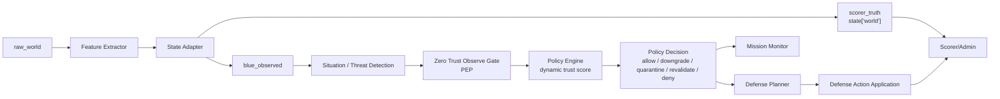

# ZTA 적용 판단

## 결론

우리 시스템에 Zero Trust Architecture(ZTA)를 **전면 아키텍처로 도입하는 것은 과하다**. 다만 Blue AI 내부에 **Zero Trust Observe/Command Policy Gate**를 부분 도입하는 것은 타당하다.

최종 권고:

```text
도입한다.
단, "전체 시스템을 ZTA로 재설계"하지 말고
Blue가 외부 observe와 C2/mission/telemetry 값을 임무 판단에 쓰기 전에
allow / downgrade / quarantine / revalidate를 결정하는 정책 관문으로 넣는다.
```

이 방식이 가장 적절한 이유는 다음과 같다.

- NIST SP 800-207의 ZTA는 네트워크 위치를 신뢰하지 않고, 리소스 접근을 매 요청마다 정책으로 판단하는 구조다.
- 우리 시스템의 핵심 문제도 “외부에서 들어온 observe를 어디까지 믿고 임무 판단에 사용할 것인가”다.
- 하지만 UAV/UGV/SATCOM 환경의 실제 공격은 RF, GNSS, 센서 물리, C2 timing, telemetry 정합성 문제까지 포함하므로 ZTA만으로는 부족하다.
- 따라서 최선은 ZTA를 **Blue의 접근/사용 정책 계층**으로 쓰고, 기존의 sensor fusion, invariant check, cryptographic metadata, anti-replay, recovery/resilience 모델과 결합하는 것이다.

## 1. NIST SP 800-207 핵심 이해

NIST SP 800-207은 ZTA를 단일 제품이나 단일 네트워크 구조가 아니라, **암묵적 신뢰를 제거하고 리소스 접근을 계속 검증하는 보안 원칙과 논리 구조**로 설명한다.

핵심 요지:

| ZTA 개념 | 쉬운 설명 | 우리 시스템식 해석 |
|---|---|---|
| No implicit trust | 내부망, 소유 장비, 익숙한 채널이라고 자동 신뢰하지 않는다. | `blue_observed.external_observe`는 기본적으로 의심 가능한 입력이다. |
| Per-session access | 한 리소스 접근 허가가 다른 리소스 접근 허가로 이어지지 않는다. | C2 command가 정상이어도 mission priority나 telemetry까지 자동 신뢰하지 않는다. |
| Dynamic policy | identity, device state, behavior, environment를 보고 동적으로 판단한다. | auth/signature, sequence, ACK, latency, internal/external gap, domain_trust를 함께 본다. |
| Least privilege | 필요한 최소 권한만 준다. | 외부 observe 전체를 허용하지 않고 field/domain 단위로 사용 권한을 준다. |
| PE/PA/PEP | 정책 판단, 정책 실행, 강제 지점이 분리된다. | Blue Policy Engine, Defense Planner, Observe Gate로 나눌 수 있다. |
| Continuous monitoring | 자산 상태와 위협 정보를 계속 반영한다. | combat step마다 domain trust, effect sensitivity, availability, history를 업데이트한다. |

NIST는 ZTA의 논리 구성요소로 Policy Engine(PE), Policy Administrator(PA), Policy Enforcement Point(PEP)를 둔다. PE는 접근 허용/거부 판단을 하고, PA는 그 결정을 실행 경로로 만들며, PEP는 실제 연결 또는 접근을 허용/감시/종료한다. 우리 시스템에서는 이것을 네트워크 연결 대신 **observe 사용 권한**에 적용하면 된다.

## 2. 현재 우리 아키텍처 flow

현재 기준 flow:

```text
raw_world
-> Feature Extractor
-> State Adapter
-> scorer_truth(state["world"]) + blue_observed
-> Situation Tagger
-> Red Attack Selector / Blue Threat Detection
-> Mutation / Defense Action
-> Scorer/Admin 판정
```

현재 Blue flow:

```text
Redaction Boundary
-> Situation/Threat Detection
-> Goal Consistency Checker
-> Mission Monitor
-> Defense Planner
-> Defense Action Application
-> Incident Report / Feedback Learner
```

이미 잘하고 있는 부분:

| 현재 장점 | 설명 |
|---|---|
| scorer_truth / blue_observed 분리 | Blue가 정답지를 보지 못한다. |
| internal/external observe 분리 | Red는 internal observe를 직접 변조하지 못한다. |
| Mutation Policy | Red mutation이 허용 필드와 max delta 안에서만 일어난다. |
| Goal Consistency Checker | Blue가 Red goal을 보지 않고 observed-only effect를 추정한다. |
| Defense Planner | 의심도와 trust에 따라 staged defense를 고른다. |
| Availability cost model | 방어가 공짜가 아니며 과방어가 RED_ATTRITION으로 이어질 수 있다. |
| Combat step 구조 | 라운드 안에서 Red/Blue가 탐색, 대기, 방어, 재시도를 반복한다. |

## 3. 현재 아키텍처의 단점

ZTA 관점에서 보면 현재 구조의 단점은 다음과 같다.

| 단점 | 왜 문제인가 | ZTA와의 관련성 |
|---|---|---|
| 외부 observe 사용 전 명시적 접근 결정이 없다 | 탐지는 하더라도, 어떤 field를 임무 판단에 사용해도 되는지 별도 정책 로그가 약하다. | PEP/PE 부재 |
| command/telemetry/mission 신뢰가 domain 단위로 뭉쳐 있다 | C2 command는 보류해야 하지만 ACK metadata는 관찰 근거로 쓸 수 있는 상황을 세밀하게 표현하기 어렵다. | least privilege 부족 |
| source identity와 device posture가 약하다 | UAV, UGV, GCS, relay, SATCOM gateway 같은 non-person entity의 신뢰 상태가 명확히 모델링되지 않는다. | NPE identity 부족 |
| 방어 action과 접근 제어 action이 섞여 있다 | `HOLD_COMMAND`, `QUARANTINE_FIELD`, `REQUEST_REVALIDATION`이 정책 결정인지 복구 action인지 경계가 흐릴 수 있다. | PA/PEP 경계 부족 |
| Blue availability와 접근 정책이 직접 연결되지 않는다 | 가용성이 낮을 때 어떤 입력을 downgrade하고 어떤 입력만 허용할지 정책적으로 표현하기 어렵다. | dynamic policy 부족 |
| 공격이 observe 값 싸움으로 보일 위험 | “값을 바꿨고 탐지했다”를 넘어서 “어떤 리소스 사용 권한이 취소/제한되었는가”가 약하다. | resource-centric 관점 부족 |
| policy decision 로그가 별도 구조로 없다 | 보고서에서 Blue가 왜 이 값을 믿거나 버렸는지 설명력이 부족하다. | auditability 부족 |

핵심은 이것이다.

```text
현재 Blue는 "이상 탐지와 방어"는 하지만,
"외부 observe를 임무 판단 리소스로 사용할 권한을 부여/거부하는 관문"은 아직 약하다.
```

## 4. 이 단점을 ZTA로 잡을 수 있는가

부분적으로 잡을 수 있다.

ZTA로 잘 잡히는 문제:

| 문제 | ZTA 적용 효과 |
|---|---|
| 외부 C2/telemetry를 자동 신뢰하는 문제 | 모든 외부 observe를 untrusted로 두고, field/domain별 사용 권한을 계산한다. |
| command replay / stale command | sequence, timestamp, ACK causality, auth_valid, channel state를 정책 입력으로 삼아 command 사용을 보류한다. |
| mission priority poisoning | mission report source와 evidence freshness를 보고 recommended_area 사용 권한을 downgrade한다. |
| telemetry false data injection | internal telemetry와 external telemetry gap을 보고 telemetry field 일부를 quarantine한다. |
| Blue 과방어 | 무조건 방어하지 않고 deny/downgrade/revalidate 같은 낮은 비용 정책 결정을 먼저 둔다. |
| Decision Logger 설명력 | policy decision을 별도 로그로 남겨 “왜 이 observe를 믿었는가”를 설명한다. |

ZTA로 직접 잡기 어려운 문제:

| 문제 | 이유 | 필요한 보완 |
|---|---|---|
| GNSS spoofing/jamming 같은 물리 신호 공격 | ZTA는 접근 제어 구조이지 RF 물리 검증 기술이 아니다. | GNSS/IMU sensor fusion, RF feature analysis |
| SATCOM delay/loss 자체 | ZTA가 지연을 없애지는 못한다. | resilient routing, channel diversity, delay-tolerant logic |
| AI 판단 오류/오탐 | 정책 구조는 설명성을 주지만 모델 정확도를 보장하지 않는다. | holdout 평가, causal checker, feedback learner |
| 정책 엔진 자체 공격 | NIST도 ZTA decision process subversion을 위협으로 본다. | policy engine hardening, audit, fallback |
| 가용성 공격 | 매 요청 검증은 비용을 늘려 availability를 깎을 수 있다. | bounded policy, low-cost revalidation, recovery model |

따라서 ZTA는 “만능 방어”가 아니라 **Blue가 외부 관측값을 믿는 방식을 더 명료하게 만드는 구조화 도구**로 쓰는 것이 맞다.

## 5. 실제 사례가 있는가

있다. 다만 대부분은 enterprise/cloud 중심이고, UAV 전장 환경에서는 연구/실험 성격이 강하다.

| 사례 | 내용 | 우리에게 주는 의미 |
|---|---|---|
| Google BeyondCorp | Google은 privileged intranet 요구를 제거하고 corporate application을 인터넷 접근 가능 구조로 옮기는 zero-trust식 접근을 공개했다. | “내부망이라 안전하다”를 버리고 application/resource 단위 접근 정책을 둔 실제 대규모 사례다. |
| 미국 연방정부 OMB M-22-09 | 미국 정부는 FY2024까지 구체적 ZTA 목표를 달성하도록 기관에 요구했고, identity/device/network/application/data 5개 축을 제시했다. | ZTA가 단순 이론이 아니라 정부/공공 영역에서 실제 전환 목표로 채택되었다. |
| NIST SP 800-207 use cases | multi-cloud, satellite facilities, contractor access, cross-enterprise collaboration 등 복잡한 경계 환경을 ZTA 적용 대상으로 설명한다. | UAV/UGV/SATCOM도 “단일 perimeter가 없는 분산 mission network”로 볼 수 있다. |
| UAV ZTA 연구 | UAV RF 신호와 딥러닝/XAI를 이용해 UAV 식별/검증을 ZTA 관점에 연결한 연구가 있다. | 전장 UAV 쪽에도 ZTA를 identity/verification 프레임으로 연결하려는 연구가 있다. 다만 운영 검증 사례로 보기는 어렵다. |
| 5G/6G/O-RAN i-ZTA 연구 | 동적이고 신뢰하기 어려운 통신망에서 monitoring/evaluate/decide 구조를 제안한다. | SATCOM/mesh/C2 통신처럼 신뢰 경계가 흐린 네트워크에 ZTA식 policy decision이 어울린다. |

정리하면:

```text
실제 enterprise 적용 사례는 있다.
정부/공공 전환 사례도 있다.
UAV/전장 통신 적용은 아직 연구 성격이 강하므로,
우리 보고서에서는 "검증된 enterprise 원칙을 UAV/UGV/SATCOM observe gate로 제한 적용"한다고 쓰는 편이 안전하다.
```

## 6. ZTA가 최선인가

단독으로는 최선이 아니다.

ZTA가 최선인 영역:

- 외부 observe / command / telemetry / mission report를 리소스로 보고 사용 권한을 통제하는 영역
- Blue가 “이 값을 믿어도 되는가”를 설명해야 하는 영역
- Red가 외부 observe를 오염시키는 공격을 할 때, Blue가 최소권한으로 대응해야 하는 영역
- 보고서에서 방어 AI 구조를 깔끔하게 설명해야 하는 영역

ZTA보다 다른 기법이 더 직접적인 영역:

| 영역 | 더 직접적인 기법 |
|---|---|
| C2 command 위조/재전송 | cryptographic signing, anti-replay window, sequence/timestamp monotonicity |
| GNSS spoofing/jamming | GNSS/IMU/RF cross-check, multi-sensor fusion |
| SATCOM delay/loss | redundant channel, delay-tolerant command policy, channel state estimation |
| stealthy observe drift | invariant checking, causal consistency, temporal anomaly detection |
| 가용성 고갈 | recovery model, cost-aware defense planner, MTD-style randomization |
| AI 정책 과적합 | holdout scenario, diversity guard, causal checker |

따라서 최선은 다음 조합이다.

```text
ZTA-inspired Observe/Command Policy Gate
+ cryptographic metadata / anti-replay
+ internal-external sensor fusion
+ causal consistency checker
+ cost-aware defense planner
+ recovery/resilience model
```

## 7. 넣는다면 어디에 넣을까

권장 위치:

```text
blue_observed
-> Situation/Threat Detection
-> Zero Trust Observe/Command Policy Gate
-> Mission Monitor
-> Defense Planner
-> Defense Action Application
-> Scorer
```

왜 Situation/Threat Detection 뒤인가:

- Blue가 값을 “운영에 사용”하기 전에 policy gate를 거는 것이 목적이다.
- 하지만 policy gate가 판단하려면 tags, threats, internal/external gap, history가 필요하다.
- 따라서 tagger/detector는 원본 observed를 읽되, Mission Monitor와 Defense Planner가 쓰는 operational view는 policy gate가 정제한다.

권장 모듈:

```text
src/dah_flawless/blue/zero_trust_gate.py
```

권장 출력:

```json
{
  "domain": "command",
  "resource": "blue_observed.c2_message.command",
  "subject": "external_c2_source",
  "decision": "REVALIDATE",
  "trust_score": 0.42,
  "reasons": [
    "sequence lag",
    "ack causality gap",
    "satcom latency high"
  ],
  "allowed_use": "detection_only",
  "availability_cost": 0.01
}
```

결정 enum:

| decision | 의미 | 결과 |
|---|---|---|
| `ALLOW` | 임무 판단에 사용 가능 | Mission Monitor로 그대로 전달 |
| `ALLOW_WITH_LOW_CONFIDENCE` | 사용은 가능하지만 confidence 감소 | risk 증가, 약한 revalidation |
| `DOWNGRADE` | 일부 field만 사용 | mission/command decision에서 제외 가능 |
| `QUARANTINE` | 해당 field/domain 운영 사용 금지 | Defense Planner에 quarantine action 후보 전달 |
| `REVALIDATE` | 추가 확인 전까지 보류 | `REQUEST_REVALIDATION` 후보 전달 |
| `DENY` | 사용 금지 | command hold 또는 fallback |

## 8. 우리 구조에 매핑한 ZTA 구성요소

| ZTA 구성요소 | 우리 시스템 모듈 |
|---|---|
| Subject | external C2 source, telemetry source, mission report source, UAV/UGV/SATCOM relay |
| Resource | command, ACK, telemetry field, mission priority, recommended_area, comms state |
| Policy Enforcement Point(PEP) | `ZeroTrustObserveGate` |
| Policy Engine(PE) | domain_trust, effect_sensitivity, history, tags, auth/sequence/latency를 종합하는 scoring function |
| Policy Administrator(PA) | Defense Planner에 `HOLD_COMMAND`, `QUARANTINE_FIELD`, `REQUEST_REVALIDATION` 같은 action candidate 전달 |
| Policy Information Point(PIP) | internal_observe, history, capabilities, auth_valid, signature_present, sequence, ACK, comms quality, scorer feedback |
| Continuous Diagnostics | Blue Feedback Learner, readiness gate, availability recovery |
| Audit | Decision Logger, frontend replay log, scorer evidence |

## 9. 장점

ZTA-inspired gate를 넣었을 때 장점:

| 장점 | 설명 |
|---|---|
| 구조가 깔끔해진다 | 탐지, 정책판단, 방어실행이 분리된다. |
| 보고서 설명력이 좋아진다 | “탐지했다”가 아니라 “이 observe는 detection_only로 강등했다”를 설명할 수 있다. |
| 값 바꾸기 싸움에서 벗어난다 | Red 공격이 resource access/use decision을 흔드는 효과로 표현된다. |
| 과방어를 줄일 수 있다 | `QUARANTINE` 전에 `DOWNGRADE`, `REVALIDATE` 같은 낮은 비용 선택지가 생긴다. |
| Blue 학습 목표가 명확해진다 | detection success뿐 아니라 policy decision correctness를 학습 지표로 삼을 수 있다. |
| 실제 자료와 연결된다 | NIST 800-207, OMB ZTA strategy, BeyondCorp 사례와 자연스럽게 연결된다. |
| frontend replay가 좋아진다 | 라운드별로 “어떤 입력이 허용/거부/강등됐는지”를 시각화하기 쉽다. |

## 10. 리스크

| 리스크 | 설명 | 완화 |
|---|---|---|
| 과설계 | 대회 MVP에서 너무 많은 정책 계층이 생길 수 있다. | 전체 ZTA가 아니라 Blue gate 하나만 도입 |
| availability 비용 증가 | 매번 검증하면 Blue 가용성이 더 깎일 수 있다. | low-cost decision, bounded revalidation cost |
| false deny | 정상 command/telemetry를 막아 mission failure가 생길 수 있다. | `ALLOW_WITH_LOW_CONFIDENCE`, `DOWNGRADE` 사용 |
| policy engine 공격면 | 공격자가 policy input을 조작해 gate를 속일 수 있다. | internal_observe, history, causal checker를 PIP로 사용 |
| ZTA 만능론 | RF/GNSS 물리 공격까지 ZTA로 막는다고 과장할 수 있다. | 문서에서 ZTA의 한계를 명시 |
| 로그 복잡도 증가 | decision log가 길어진다. | frontend log와 training log를 계속 분리 |

## 11. 구현 시 수정사항

최소 구현:

```text
1. src/dah_flawless/blue/zero_trust_gate.py 추가
2. ZtaDecision dataclass 추가
3. RoundCombatRunner와 run_simulation에서 threat detection 뒤에 gate 호출
4. Mission Monitor / Defense Planner가 zta_decisions를 입력으로 받게 확장
5. Score evidence에 zta_policy_decisions 추가
6. frontend replay log에 policy decision timeline 추가
7. tests/test_zero_trust_gate.py 추가
```

필요한 decision features:

| feature | 출처 |
|---|---|
| `auth_valid`, `signature_present`, `checksum_valid` | `blue_observed.c2_message` |
| `sequence_gap`, `timestamp_skew`, `ack_gap` | tags/threat evidence |
| `internal_external_gap` | `internal_observe` vs `external_observe` |
| `domain_trust` | `defense_runtime.domain_trust` |
| `effect_hypothesis` | `Goal Consistency Checker` |
| `availability`, `trust_budget` | `mission` |
| `capability_state` | `capabilities` |
| `recent_recovery_success` | recovery history / scorer feedback |

권장 scoring:

```text
trust_score =
  0.30 * identity_auth_score
+ 0.20 * freshness_score
+ 0.20 * internal_consistency_score
+ 0.15 * domain_trust
+ 0.10 * channel_health_score
+ 0.05 * capability_score
- threat_confidence_penalty
```

decision threshold 예:

| trust_score | decision |
|---:|---|
| 0.80 이상 | `ALLOW` |
| 0.65~0.80 | `ALLOW_WITH_LOW_CONFIDENCE` |
| 0.45~0.65 | `DOWNGRADE` |
| 0.25~0.45 | `REVALIDATE` |
| 0.10~0.25 | `QUARANTINE` |
| 0.10 미만 | `DENY` |

## 12. ZTA를 넣었을 때 flow



## 13. 넣지 말아야 할 방식

아래 방식은 비추천한다.

| 비추천 방식 | 이유 |
|---|---|
| 전체 시스템을 ZTA로 이름만 바꾸기 | 실제 개선 없이 보고서 용어만 늘어난다. |
| Red 쪽에 ZTA를 넣기 | Red는 공격/변조 AI이므로 ZTA의 보호 대상이 아니다. Red에는 mutation policy가 더 적합하다. |
| 모든 observe를 매번 deny/revalidate | Blue availability가 급격히 깎여 RED_ATTRITION을 부른다. |
| ZTA로 GNSS/RF spoofing을 직접 막는다고 주장 | ZTA는 물리 신호 검증 기술이 아니다. |
| LLM에게 policy decision을 전부 맡기기 | 재현성과 안전성이 떨어진다. LLM은 reviewer로만 둔다. |

## 14. 최종 판단

```text
ZTA는 넣는 것이 좋다.
하지만 전체 아키텍처를 ZTA로 재작성하지 않는다.

우리 시스템에서 최선의 적용 위치는 Blue 내부의
"Zero Trust Observe/Command Policy Gate"다.

이 gate는 외부 observe가 임무 판단에 쓰이기 전에
field/domain 단위로 allow, downgrade, quarantine, revalidate, deny를 결정한다.

이렇게 하면 현재 구조의 장점(raw_world/scorer_truth/blue_observed 분리,
internal/external observe 분리, mutation policy, staged defense)을 해치지 않고
정책 판단 계층만 추가할 수 있다.
```

결과적으로 ZTA-inspired gate는 우리 시스템을 더 깔끔하게 만든다.

- Red 공격은 “값 변조”가 아니라 “Blue의 resource-use decision을 교란하는 행위”로 설명된다.
- Blue 방어는 “탐지 후 무조건 방어”가 아니라 “관측값 사용 권한을 제한하고 필요한 만큼만 방어”하는 구조가 된다.
- Scorer는 `attack_success`, `goal_success`, `availability`, `recovery_success` 외에 `policy_decision_correctness`를 추가 지표로 삼을 수 있다.

따라서 다음 개발 단계에서 구현한다면 우선순위는 다음과 같다.

1. `ZeroTrustObserveGate` 설계/구현
2. `ZtaDecision` 로그 스키마 추가
3. command/ACK/telemetry/mission priority 4개 domain부터 적용
4. scorer에 `policy_decision_correctness` evidence 추가
5. frontend replay에 policy timeline 표시

## 참고 자료

- NIST SP 800-207, *Zero Trust Architecture*: https://nvlpubs.nist.gov/nistpubs/specialpublications/NIST.SP.800-207.pdf
- NIST CSRC publication page, SP 800-207: https://csrc.nist.gov/pubs/sp/800/207/final
- Google Research, *BeyondCorp: A New Approach to Enterprise Security*: https://research.google/pubs/beyondcorp-a-new-approach-to-enterprise-security/
- OMB M-22-09, *Moving the U.S. Government Toward Zero Trust Cybersecurity Principles*: https://www.whitehouse.gov/wp-content/uploads/2022/01/M-22-09.pdf
- Haque et al., *Enhancing UAV Security Through Zero Trust Architecture*: https://arxiv.org/abs/2403.17093
- Ramezanpour and Jagannath, *Intelligent Zero Trust Architecture for 5G/6G Networks*: https://arxiv.org/abs/2105.01478
